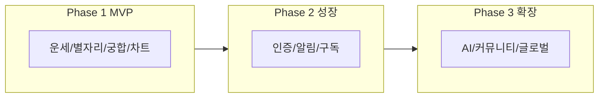

# Part B. 고도화 방향 및 로드맵

> **문서**: Part B (단일 파트 작업용)  
> **상태**: 완료 | **최종 갱신**: 2026-02-07 (B-1, B-2 반영)  
> **선행 파트**: [part_a_서비스_개요_및_현재_기능.md](part_a_서비스_개요_및_현재_기능.md) — Part A의 기능 리스트·개념 정의·핵심 산출 요약을 참조하여 본 파트를 보강·갱신한다.  
> **상위 통합본**: [../service_advancement_plan.md](../service_advancement_plan.md)

이 문서는 **Part B만** 다룰 때 사용한다. Part A에서 "미구현 항목"과 "고도화 방향 개념"을 가져와 우선순위·로드맵과 연결한다.

---

## B.1 기능 고도화 우선순위

PRD Phase 2/3와 [development_progress.md](../development_progress.md) "다음 단계", **Part A 미구현 항목**을 통합한 기능 우선순위이다.  
*목표 시기·수치는 가정이며, 실제 일정 확정 시 본 문서를 갱신할 것.*

| 기능 | 비즈니스 임팩트 | 기술 난이도 | 선행 조건 | 목표 시기(가정) | 담당 |
|------|-----------------|------------|----------|-----------------|------|
| 사용자 인증/프로필 | 높음 | 중 | 없음 | Phase 2 초기 (M4 전) | 기획+CTO |
| 푸시 알림 | 중 | 낮음 | 인증 | M4 (PRD Phase 2) | 기획+CTO |
| 결제/구독 | 높음 | 높음 | 인증 | M5 (프리미엄 구독 출시) | 기획+CTO |
| 소셜 공유 | 중 | 낮음 | 없음 | M5 (PRD Phase 2) | 기획 |
| AI 개인화 분석 | 높음 | 높음 | 인증·출생차트 데이터 | M4 (AI 개인화 v1) | 기획+CTO |
| 커뮤니티 | 중 | 높음 | 인증·모더레이션 | M7–8 (PRD Phase 3) | 기획+CTO |
| 전문가 1:1 상담 연결 | 높음 | 높음 | 인증·결제·파트너 | M7–8 (PRD Phase 3) | 기획 |

*Part A 미구현 항목 + 결제/구독 반영. 목표 시기는 PRD 7장 Phase 2·3 월별 마일스톤 기준. (B-2 갱신)*

### 고도화 개념 요약 (Part A 개념과 연계)

| 축 | 현재 (Part A 기준) | 고도화 방향 |
|----|-------------------|-------------|
| **콘텐츠** | 정적 템플릿·규칙 기반 | 개인 출생차트·트랜짓 반영 → AI 생성/해석 |
| **참여** | 비로그인·로컬 저장 | 계정·동기화·알림·공유 |
| **수익** | 무료만 | Freemium, 구독·단건·광고 |

---

## B.2 비기능 고도화

| 영역 | 항목 | 방향 |
|------|------|------|
| **성능·안정성** | 캐시 | CDN/엣지(Cloudflare) 활용, API·정적 에셋 캐시 전략 |
| | API 응답 | 목표 응답 시간·에러율 정의, 에러 핸들링·재시도 |
| **보안·규정** | 개인정보 | 최소 수집, 약관·개인정보처리방침 정리 |
| | 결제 | PCI 대비(카드 데이터 비저장), PG·빌링 연동 |
| **확장성** | 데이터 | DB/스토리지 도입 시점(PostgreSQL 등), 읽기/쓰기 규모 예측 |

---

## B.3 로드맵 다이어그램

### 단계별 핵심 배달물 (PRD 7장 로드맵 기준)

| 단계 | 기간(가정) | 핵심 배달물 |
|------|------------|-------------|
| **Phase 1** | 완료 | 운세·별자리·궁합·출생차트, 다국어 5개, Cloudflare 배포 |
| **Phase 2** | M4–M6 | M4: AI 개인화 v1·푸시 알림 / M5: 프리미엄 구독·소셜 공유 / M6: 다국어 강화·A/B 테스트 |
| **Phase 3** | M7–M12 | M7–8: 커뮤니티·전문가 상담 연결 / M9–10: 일본어·스페인어·현지화 / M11–12: AI 고도화·파트너십 |

---

## Part B 핵심 산출 요약 (다음 파트 참조용)

- **우선순위**: 인증 → 푸시·결제 → 소셜·AI → 커뮤니티·전문가 상담. 선행 조건·담당 명시. (Part A 미구현 + 결제/구독 반영)
- **고도화 3축**: 콘텐츠(템플릿→트랜짓·AI), 참여(비로그인→계정·알림·공유), 수익(무료→Freemium).
- **비기능**: 성능(캐시·API 응답), 보안(개인정보·결제 PCI), 확장성(DB 도입 시점).
- **로드맵**: Phase 1(완료) → Phase 2(M4–M6, PRD 월별 마일스톤) → Phase 3(M7–M12) 배달물 정리.

---

*Part B 끝. Part C는 [part_c_IPO_투자자_준비사항.md](part_c_IPO_투자자_준비사항.md) 참조.*
