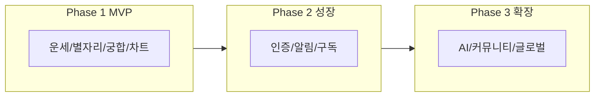

# 서비스 고도화 기획자료

> **문서 버전**: 1.1  
> **최종 수정일**: 2026-02-07  
> **작성/검토**: 기획 대표, CTO  
> **파트 문서**: docs/advancement/ (Part A–D·부록 분리본, 계획·프롬프트 문서 포함)  
> **대응 문서**: [zodiac_service_prd.md](./zodiac_service_prd.md), [development_plan.md](./development_plan.md), [development_progress.md](./development_progress.md), [competitor_analysis.md](./competitor_analysis.md)

**목적**: MVP를 넘어 서비스를 고도화·확장할 때 IPO/투자 검토에 대비한 기획 대표(서비스 기획)와 CTO의 준비 사항을 정리하고, 실제 확장 가능한 기획문서를 제공한다.  
**독자**: 내부 기획·개발 리더, (향후) 투자자·실사 담당자.

---

# Part A. 서비스 개요 및 현재 기능

## A.1 현재 구현 기능 (As-Is)

**출처**: [development_progress.md](./development_progress.md) 및 실제 `src/app` 구조 기준.

**참고 (실제 라우팅)**: 현재 앱은 **locale 라우팅 없이** 페이지가 구성되어 있다. 라우트 예: `/`(홈), `/horoscope`, `/horoscope/daily`, `/horoscope/daily/[sign]`, `/zodiac`, `/zodiac/[sign]`, `/compatibility`, `/birth-chart`. development_progress에는 `/[locale]/`로 기재된 부분이 있으나, 실제 디렉터리는 `app/page.tsx`, `app/horoscope/` 등으로 되어 있음.

### 기능 목록

| 영역 | 기능 | 상세 | 구현 상태 |
|------|------|------|----------|
| **운세** | 일일/주간/월간 운세 | 12별자리 × 5카테고리(종합·연애·금전·건강·직장), 시드 기반 생성, 다국어(ko/en/zh/ja/es) | ✅ |
| **별자리** | 별자리 상세 | 12별자리 정보, 원소·모달리티·행성, 성격 특성, 궁합 미리보기(Best 3, Worst 2) | ✅ |
| **궁합** | 궁합 분석 | 144조합, 연애/친구/업무 점수(원소 60% + 모달리티 40%), 상세 조언 | ✅ |
| **출생 차트** | Big Three·차트 휠 | 태양/달/상승궁, 도시 기반 위경도(26개 도시), SVG 차트 휠, 다국어 해석 | ✅ |
| **클라이언트** | 즐겨찾기·히스토리·설정 | Zustand + localStorage, 다국어 UI, 테마/알림 설정(UI만) | ✅ |

### 미구현(PRD 명시) 항목

| 기능 | PRD 우선순위 | 비고 |
|------|-------------|------|
| 사용자 인증/프로필 | P1 | Phase 2 선행 |
| 푸시 알림 | P2 | Phase 2 |
| 소셜 공유 | P2 | Phase 2 |
| AI 개인화 분석 | P2 | Phase 2 |
| 커뮤니티 | P3 | Phase 3 |
| 1:1 전문가 상담 연결 | P3 | Phase 3 |

---

## A.2 개념 정의 (고도화 시 일관 용어)

본 문서 및 관련 기획에서 사용하는 용어를 아래와 같이 정의한다. *PRD 부록 A와 동일한 용어는 같은 정의를 사용한다.*

### 지표·사업

| 용어 | 정의 |
|------|------|
| **MAU** | Monthly Active Users (월간 활성 사용자) |
| **DAU** | Daily Active Users (일간 활성 사용자) |
| **ARPU** | Average Revenue Per User (사용자당 평균 수익). 전체/유료 사용자 기준 구분하여 명시 |
| **리텐션 D7/D30** | 가입 후 7일/30일 내 재방문 비율 |
| **유료 전환율** | 전체 사용자 대비 유료 결제 사용자 비율 |

### 서비스·점성술

| 용어 | 정의 |
|------|------|
| **Big Three** | 태양 별자리(Sun Sign), 달 별자리(Moon Sign), 상승궁(Rising Sign) |
| **상승궁** | 출생 시점 동쪽 지평선에 위치한 별자리 |
| **트랜짓** | 현재 행성 위치가 개인 출생 차트에 미치는 영향 |
| **Freemium** | 기본 기능 무료 + 고급 기능 유료 |
| **구독/단건 결제** | 반복 결제(월/년 구독) vs 1회 결제(리포트·상담 등) |

### 서비스 핵심 개념 (현재 → 고도화)

**현재**는 천문학적 데이터(출생 시각·위치)에 **템플릿/규칙 기반** 운세 생성을 결합해, 동일 날짜·별자리 조합에 대해 일관된 결과를 제공한다. **고도화 방향**은 개인 출생 차트와 **트랜짓**(현재 행성 영향)을 반영한 뒤 **AI 생성·해석**으로 맞춤형 운세와 조언을 제공하는 것이며, 전문가 감수로 품질을 보장한다.

---

# Part B. 고도화 방향 및 로드맵

## B.1 기능 고도화 우선순위

PRD Phase 2/3와 [development_progress.md](./development_progress.md) "다음 단계", **Part A 미구현 항목**을 통합한 기능 우선순위이다.  
*목표 시기·수치는 가정이며, 실제 일정 확정 시 본 문서를 갱신할 것.*

| 기능 | 비즈니스 임팩트 | 기술 난이도 | 선행 조건 | 목표 시기(가정) | 담당 |
|------|-----------------|------------|----------|-----------------|------|
| 사용자 인증/프로필 | 높음 | 중 | 없음 | Phase 2 초기 (M4 전) | 기획+CTO |
| 푸시 알림 | 중 | 낮음 | 인증 | M4 (PRD Phase 2) | 기획+CTO |
| 결제/구독 | 높음 | 높음 | 인증 | M5 (프리미엄 구독 출시) | 기획+CTO |
| 소셜 공유 | 중 | 낮음 | 없음 | M5 (PRD Phase 2) | 기획 |
| AI 개인화 분석 | 높음 | 높음 | 인증·출생차트 데이터 | M4 (AI 개인화 v1) | 기획+CTO |
| 커뮤니티 | 중 | 높음 | 인증·모더레이션 | M7–8 (PRD Phase 3) | 기획+CTO |
| 전문가 1:1 상담 연결 | 높음 | 높음 | 인증·결제·파트너 | M7–8 (PRD Phase 3) | 기획 |

### 고도화 개념 요약 (Part A 개념과 연계)

| 축 | 현재 (Part A 기준) | 고도화 방향 |
|----|-------------------|-------------|
| **콘텐츠** | 정적 템플릿·규칙 기반 | 개인 출생차트·트랜짓 반영 → AI 생성/해석 |
| **참여** | 비로그인·로컬 저장 | 계정·동기화·알림·공유 |
| **수익** | 무료만 | Freemium, 구독·단건·광고 |

---

## B.2 비기능 고도화

| 영역 | 항목 | 방향 |
|------|------|------|
| **성능·안정성** | 캐시 | CDN/엣지(Cloudflare) 활용, API·정적 에셋 캐시 전략 |
| | API 응답 | 목표 응답 시간·에러율 정의, 에러 핸들링·재시도 |
| **보안·규정** | 개인정보 | 최소 수집, 약관·개인정보처리방침 정리 |
| | 결제 | PCI 대비(카드 데이터 비저장), PG·빌링 연동 |
| **확장성** | 데이터 | DB/스토리지 도입 시점(PostgreSQL 등), 읽기/쓰기 규모 예측 |

---

## B.3 로드맵 다이어그램

### 단계별 핵심 배달물 (PRD 7장 로드맵 기준)

| 단계 | 기간(가정) | 핵심 배달물 |
|------|------------|-------------|
| **Phase 1** | 완료 | 운세·별자리·궁합·출생차트, 다국어 5개, Cloudflare 배포 |
| **Phase 2** | M4–M6 | M4: AI 개인화 v1·푸시 알림 / M5: 프리미엄 구독·소셜 공유 / M6: 다국어 강화·A/B 테스트 |
| **Phase 3** | M7–M12 | M7–8: 커뮤니티·전문가 상담 연결 / M9–10: 일본어·스페인어·현지화 / M11–12: AI 고도화·파트너십 |

---

# Part C. IPO/투자자 관점 준비사항

## C.1 기획 대표(서비스 기획 책임자) 준비사항

*아래 내용은 PRD 2·3·5·8·9장 및 [competitor_analysis.md](./competitor_analysis.md)를 참조한 투자자 메모용 정리이다.*

### 시장·사업성 (PRD 2·3장)

- **시장**: 글로벌 점성술 시장 2024 $3.94B → 2031 $22.8B 예상, **CAGR 25%+**. 모바일 앱 비중 60%+, 2025년 앱 수익 예상 $2.85B. (Harris Poll 2024: 95%가 별자리 인지, 70% 점성술 신뢰, 이용 목적 오락 58%·자기이해 31%.)
- **타겟**: Gen Z 탐험가(18–25), 밀레니얼 전문가(26–35), 라이트 유저(전 연령), 딥 엔쓰지스트(25–45). 페르소나 3종 — 지민(대학생·공유 니즈), 수현(마케터·의사결정 참고), 마이클(프리랜서·전문성 니즈).
- **수익 모델** (PRD 5장): **Freemium** + 구독($4.99/월, $39.99/년) + 단건($1.99~$14.99) + 광고. 12개월 후 가정(MAU 100만, 전환 3%, 구독 70%·단건 30%) 시 **월 ~$151K** (구독 $105K·단건 $27K·광고 $19K 수준).
- **경쟁 포지셔닝** (competitor_analysis 4.3): 정확성(전문가 수준, ≥Co-Star) · 디자인(모던, >Astro.com) · 개인화(AI+전문가) · 글로벌(5개 언어) · 접근성(웹+앱). **차별화 3가지** — (1) 정확한 천문 데이터 기반 출생 차트, (2) 다국어·글로벌 설계, (3) AI 개인화(계획)+전문가 감수.

### 지표·로드맵

- **KPI 대시보드 요약** (PRD 9장): MAU/DAU, D7·D30 리텐션, 유료 전환율, ARPU, 세션/DAU, 세션 시간. MVP·6개월·12개월 목표값은 아래 표 참조.

| 구분 | 지표 | MVP 목표 | 6개월 | 12개월 |
|------|------|---------|-------|--------|
| 획득 | 다운로드 | 50K | 300K | 1M |
| 활성화 | DAU | 5K | 30K | 100K |
| 리텐션 | D7/D30 | 30%/15% | 35%/20% | 40%/25% |
| 수익 | 유료 전환율, ARPU | 1%, $0.50 | 2%, $1.50 | 3%, $3.00 |
| 참여 | 세션/DAU, 세션 시간 | 1.5, 3분 | 2.0, 4분 | 2.5, 5분 |

- **12–24개월 로드맵** (Part B 연계): Q1 인증 출시 → Q2 푸시·구독·소셜(M4–M5) → Q3 A/B·다국어 강화(M6) → Q4 커뮤니티·전문가 상담(M7–8) → 이어서 현지화·AI 고도화(M9–12). 주요 기능·지역 출시 일정은 리소스에 따라 조정.

### 리스크·규제

- **리스크 매트릭스** (PRD 8장):

| 리스크 | 영향도 | 확률 | 대응 |
|--------|--------|------|------|
| 콘텐츠 품질 부족 | 높음 | 중 | 전문가 자문, AI 품질 검증 |
| 경쟁사 대응 | 중 | 높음 | 차별화 포인트 지속 강화 |
| 기술적 정확도 이슈 | 높음 | 낮음 | 천문 데이터 검증, 전문가 리뷰 |
| 개인정보 우려 | 높음 | 중 | 투명한 정책, 최소 수집 원칙 |
| 앱스토어 정책 | 중 | 낮음 | 가이드라인 준수, 대체 유통 채널 |

- **규제 체크리스트** (투자자 메모용): (한국) 개인정보보호법·최소 수집 원칙, (유럽) GDPR·동의·이전 제한, (공통) 결제 PCI·카드 데이터 비저장, 광고 정책·COPPA(미성년자) 고려.

**산출물 예시**: "서비스 기획 요약서" 3–5페이지 (투자 메모용).

---

## C.2 CTO 준비사항

*투자자 질의응답용 기술 개요·확장 계획 요약 (2–4페이지 분량).*

### 기술 스택·아키텍처

**현재 (Phase 1 MVP)**  
- **프론트**: Next.js 15 (App Router), TypeScript, Tailwind CSS, next-intl(5개 언어), Zustand(클라이언트 상태·localStorage persist).  
- **백엔드**: Next.js API Routes. 영속 데이터는 JSON 파일·로컬 상태만 사용(DB 미도입).  
- **배포**: Cloudflare Workers/Pages, OpenNext + Wrangler. 이미지 unoptimized(엣지 제약).  
- **점성 계산**: 프로젝트 내 astronomia 기반 로직(출생 차트·Big Three).

**12개월 내 계획 (Part B 비기능 고도화 연계)**  
- **DB**: 사용자·프로필·구독 정보 등 영속화 필요 시점에 PostgreSQL(또는 호스팅 RDS) 도입. 읽기/쓰기 규모 예측 후 관계형 유지.  
- **인증**: B2C(이메일·소셜) 도입, 세션·토큰 저장소(DB 또는 Redis) 검토.  
- **결제**: PG·빌링(구독) 연동. 카드 데이터 비저장(PCI 범위 최소화).  
- **캐시/CDN**: Cloudflare 엣지 캐시 활용, API(운세 등)·정적 에셋 캐시 규칙·TTL 정의.

### 확장성·안정성

- **트래픽 가정**: MAU 50만 구간까지는 현재 구조(Cloudflare 엣지·API Routes)로 대응 가능. 100만~200만 구간에서 DB·세션 저장소·캐시 계층(Redis 등) 도입 시점 검토. 워커/서버리스 한도 모니터링.  
- **가용성·SLA**: 목표 가용성(예: 99.5%+) 정의, 장애 감지·알림·롤백 절차, 에스컬레이션 경로 문서화.

### 보안·컴플라이언스

- **인증·세션**: 안전한 세션/토큰 저장, HTTPS·쿠키 옵션 정리.  
- **개인정보**: 최소 수집, 암호화 저장·전송, 약관·개인정보처리방침과 기술 구현 일치.  
- **로그·감사**: 접근 로그·중요 이벤트 로그 보관, 감사 추적 가능 범위 정의.  
- **외부 감사 대비**: 보안·개인정보 점검 체크리스트(인증·저장·전송·삭제·제3자 제공) 정리.

### 팀·일정

- **Phase 2/3 필요 역할**: 백엔드(DB·API·인증·결제 연동), 인프라/DevOps(배포·캐시·모니터링), 보안·개인정보 검토, QA(기능·부하).  
- **운영 방식**: 전담 인력 채용 또는 외주/파트너십 병행 가정. Part B 로드맵(M4–M12)에 맞춰 인력·일정 동기화.

**산출물 예시**: "기술 개요 및 확장 계획" 2–4페이지 (CTO 투자자 질의응답용).

---

## C.3 공통 (기획 대표 + CTO)

### 현재 상태 한 장 요약 (Part A 반영)

| 항목 | 내용 |
|------|------|
| 기능 완성도 | Phase 1 MVP 완료: 운세·별자리·궁합·출생차트·다국어 5개·클라이언트 즐겨찾기/히스토리 |
| 배포 환경 | Cloudflare (OpenNext + Wrangler), 이미지 unoptimized |
| 사용자/수익 | (실제 수치 확보 시 갱신) |

### 다음 12개월 핵심 마일스톤 (Part B 로드맵 연계)

1. **M4 전**: 사용자 인증/프로필 출시 (Phase 2 선행)  
2. **M4**: AI 개인화 v1, 푸시 알림  
3. **M5**: 프리미엄 구독 출시, 소셜 공유  
4. **M6**: 다국어 강화, A/B 테스트  
5. **M7–8**: 커뮤니티 기능, 전문가 상담 연결  
6. **M9–10**: 일본어·스페인어·현지화  
7. **M11–12**: AI 고도화, 파트너십  

*실제 일정은 리소스·우선순위에 따라 조정. Part B 단계별 배달물과 동기화.*

---

# Part D. 서비스 확장 준비 (기술·운영)

## D.1 트래픽·데이터 확장 (Part B 비기능 고도화·확장성 연계)

Part B B.2 "확장성 | 데이터: DB/스토리지 도입 시점(PostgreSQL 등), 읽기/쓰기 규모 예측"과 동일 방향으로 실행 항목을 구체화한다.

- **캐시 (실행)**: Cloudflare 엣지 — (1) 정적 에셋: 장기 캐시(1일~1주), 버전/해시 무효화. (2) API(운세·별자리): 쿼리 키(날짜·sign·locale) 기준, TTL 1시간, Stale-While-Revalidate. (3) Cache-Control·CDN 규칙 문서화.
- **DB 도입 시점**: 인증·구독 도입 시점에 영속 계층 필요. MAU 50만 전 PostgreSQL(또는 RDS) 도입. 읽기/쓰기 규모 예측 후 리드 레플리카·Redis 캐시 검토. 호스팅 지역은 타겟(한국·글로벌)에 맞춰 선택.
- **세션·파일 스토리지**: 세션 — DB 테이블 또는 Redis, TTL·갱신 정책 정의. 파일 — 프로필·업로드는 S3 호환(Cloudflare R2 등), 버킷 정책·URL 서빙·접근 제어(공개/비공개) 정의.

---

## D.2 다국어·현지화

- **현재**: 5개 언어(ko, en, zh, ja, es) 유지. next-intl·메시지 JSON, 운세·별자리·궁합 데이터/템플릿 다국어.
- **신규 언어 추가 절차**: (1) next-intl `messages/{locale}.json` 추가. (2) `public/data`·운세 템플릿·별자리/궁합 데이터에 locale 키 추가. (3) 번역 QA 체크리스트 수행. (4) config locale 목록·기본 locale 반영.
- **현지화 체크리스트**:
  - **통화**: 결제·구독 도입 시 표시 통화(USD/KRW 등)·결제 통화 정책, locale별 통화 포맷.
  - **날짜·숫자**: locale별 날짜/시간/숫자 형식 적용, next-intl 또는 Intl API 사용.
  - **라우팅(선택)**: locale 기반 라우팅(`/ko/`, `/en/` 등) 도입 시 — 라우트 구조 정의, 기본 locale 리다이렉트, hreflang·SEO 반영.

---

## D.3 수익화 연동

- **결제 파이프라인**: PG·빌링(구독) 벤더 선정 → 연동(결제·웹훅·이벤트) → 구독 상태·엔티티 연동 → 정기 결제 실패 시 재시도·알림·상태 전환 플로우. 카드 데이터 비저장(PCI 최소화) 유지.
- **환불 정책**: 환불 가능 기간·조건(미사용 기간 등) 명시, PG/빌링 측 환불 처리·웹훅 반영, 구독/액세스 상태 동기화.
- **광고 연동 시 고려사항**: (1) **브랜드 세이프티**: 노출 위치·광고주/콘텐츠 정책·블록리스트. (2) **개인정보**: COPPA(미성년자)·GDPR·동의·개인화 여부, 데이터 공유 범위.

---

## D.4 모니터링·운영 (Part C CTO 가용성·장애 대응 연계)

- **에러 추적**: 클라이언트·서버 에러 로그 수집 도구 도입, 에러율·유형별 집계, 알림 설정.
- **성능·비용 대시보드**: (1) 성능 — API 응답 시간(p50/p95)·에러율·가용성(Cloudflare Analytics·APM). (2) 비용 — Cloudflare·DB·외부 API(결제·AI) 사용량·비용, 예산 대비 알림.
- **배포·롤백**: 배포 절차(빌드→스테이징→프로덕션) 문서화. 롤백 — 이전 버전 재배포 절차·트래픽 전환 방식 정의.
- **장애 에스컬레이션**: 장애 감지 시 1차 담당·에스컬레이션 경로·연락처 정리. SLA — 목표 응답 시간·복구 목표(RTO) 문서화.

---

# 부록

## 1. 용어 정의 (재정리, 한눈에 보기)

| 용어 | 정의 (한 줄) |
|------|---------------|
| MAU | 월간 활성 사용자 |
| DAU | 일간 활성 사용자 |
| ARPU | 사용자당 평균 수익 |
| 리텐션 D7/D30 | 가입 후 7일/30일 재방문 비율 |
| 유료 전환율 | 전체 사용자 대비 유료 결제 비율 |
| 트랜짓 | 현재 행성 위치가 개인 출생 차트에 미치는 영향 |
| 상승궁 | 출생 시점 동쪽 지평선에 위치한 별자리 |
| Big Three | 태양 별자리·달 별자리·상승궁 |
| Freemium | 기본 무료 + 고급 유료 |
| 구독/단건 결제 | 반복 결제(월/년) vs 1회 결제(리포트·상담 등) |

*Part A A.2와 중복 최소화. 수치(MAU·ARPU·전환율)는 목표 가정, 실제 수치 확보 시 반영.*

---

## 2. 기존 문서 링크

| 문서 | 경로 | 용도 |
|------|------|------|
| PRD | [zodiac_service_prd.md](./zodiac_service_prd.md) | 제품 요구사항·시장·수익·로드맵·KPI·리스크 |
| 개발 계획서 | [development_plan.md](./development_plan.md) | 기술 스택·MVP 순서·API·페이지 구조 |
| 개발 진행 상황 | [development_progress.md](./development_progress.md) | 완료 기능·파일 목록·다음 단계 |
| 경쟁사 분석 | [competitor_analysis.md](./competitor_analysis.md) | 경쟁사·차별화 기회·대응 전략 |
| 마케팅 전략 | [marketing_psychology_strategy.md](./marketing_psychology_strategy.md) | 심리학 기반 마케팅 |
| 다국어 키워드 | [multilingual_keyword_strategy.md](./multilingual_keyword_strategy.md) | SEO·키워드 전략 |
| 고도화 통합본 | [service_advancement_plan.md](./service_advancement_plan.md) | Part A–D·부록 통합본 |

---

## 3. 경쟁사·시장 요약 (1페이지)

**시장 규모·CAGR** (PRD 2.1): 글로벌 점성술 시장 2024 $3.94B → 2031 $22.8B 예상, **CAGR 25%+**. 모바일 앱 비중 60% 이상, 2025년 앱 수익 예상 $2.85B.

**경쟁 포지션** (competitor_analysis): Astro.com(전문성·구식), Co-Star(AI·소셜·모던), Cafe Astrology(교육·SEO), 포스텔러(국내 1위·앱), 네이버 운세(접근성). 상세는 [competitor_analysis.md](./competitor_analysis.md).

**우리 차별화 3줄**: (1) 정확한 천문 데이터 기반 출생 차트·전문가 수준 정확성. (2) 다국어·글로벌 설계(5개 언어)·모던 UX. (3) AI 개인화(계획) + 전문가 감수로 품질 보장.

---

*문서 끝*
